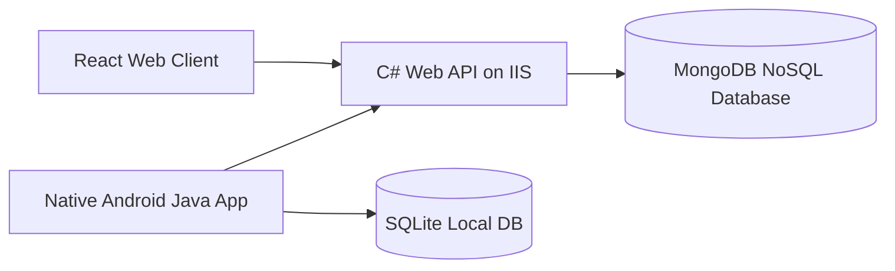
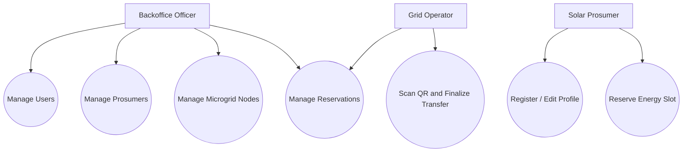
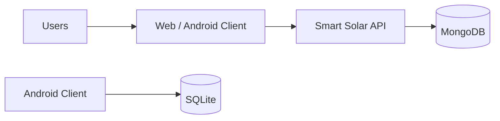

# Smart Solar Microgrid Trading System Report

## 1. Introduction

Describe the purpose of the Smart Solar Microgrid Trading System and the users: Backoffice officers, Grid Operators, and Solar Prosumers.

## 2. System Architecture

The solution follows client-server architecture with a FAT service pattern. Business rules are implemented in the C# Web API. The web and Android applications act as UI clients and communicate with the API through REST endpoints. MongoDB stores server-side data, and Android SQLite stores local user/cache data.

## 3. High-Level Diagram

## 4. Use Case Diagram

## 5. DFD

## 6. Database Design

### Users

Fields: `id`, `username`, `passwordHash`, `role`, `status`, `prosumerNic`, `createdAtUtc`.

### Prosumers

Fields: `nic`, `fullName`, `phone`, `email`, `address`, `solarCapacityKw`, `status`, `createdAtUtc`.

### SolarStationInfo

Fields: `id`, `name`, `locationName`, `latitude`, `longitude`, `capacityKwh`, `batteryStorageSlots`, `isActive`, `schedules`.

### EnergyReservations

Fields: `id`, `prosumerNic`, `nodeId`, `slotStartUtc`, `slotEndUtc`, `energyKwh`, `status`, `transactionCode`, `createdAtUtc`, `updatedAtUtc`.

## 7. Business Rules

- Reservations must be scheduled within 7 days.
- Updates and cancellations require at least 12 hours notice.
- Nodes cannot be deactivated while active reservations exist.
- Deactivated prosumers can only be reactivated by a Backoffice officer.
- QR finalization is verified against the central server.

## 8. Screenshots

Add screenshots of every web and Android UI.

## 9. Source Code

Paste relevant source code as text. Do not use screenshots for code.

## 10. References

List Microsoft ASP.NET Core docs, MongoDB driver docs, Android SQLite docs, React/Vite docs, Google Maps docs, and QR library references if added.

## 11. Git Repository

Add GitHub repository link.

## 12. Individual Contribution

Clearly state each member's contribution.

## 13. AI Collaboration Reflection

Describe how AI was used for planning, implementation, debugging, documentation, and validation. Explain prompting strategies and how generated code was reviewed.

## 14. Challenges

Discuss integration, API connectivity, MongoDB schema design, Android networking, QR handling, and deployment challenges.
